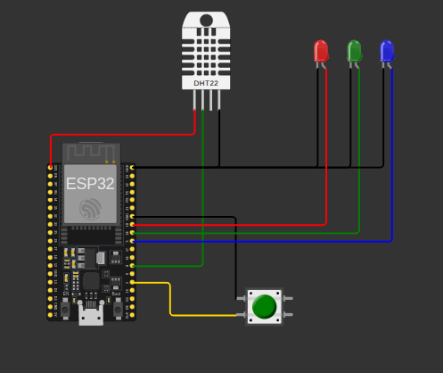
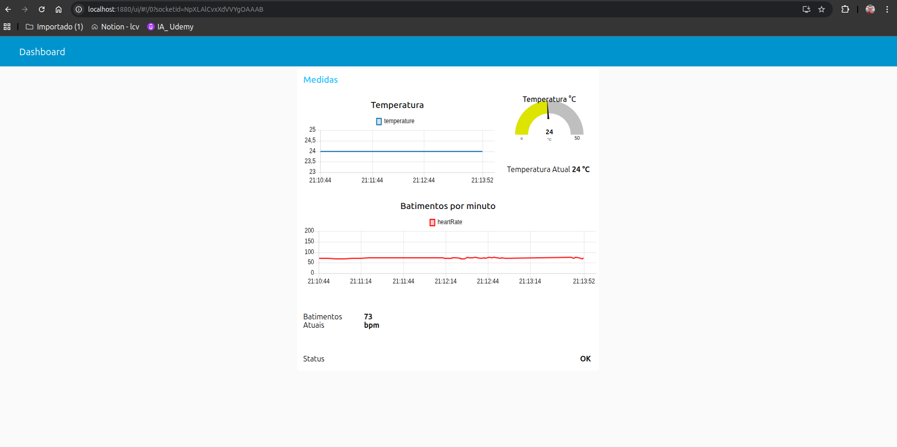
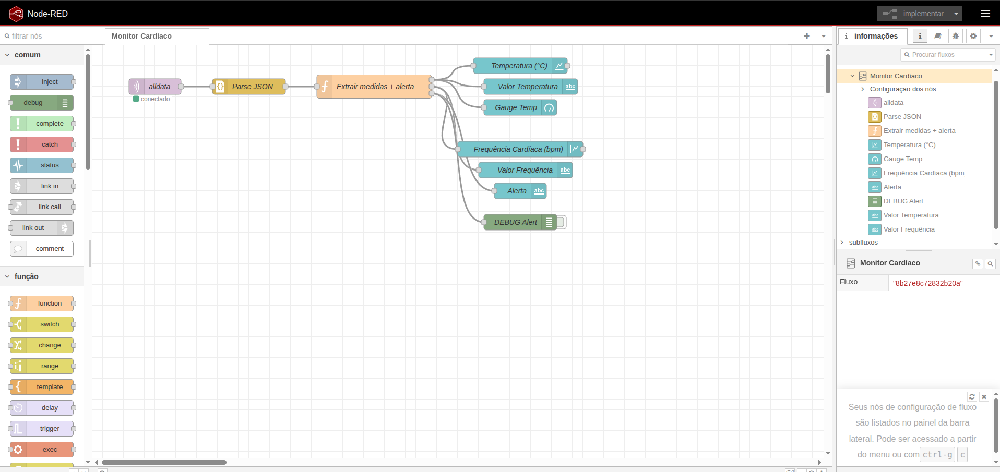

# 💓 Sistema de Monitoramento Cardíaco Vestível


Sistema IoT completo de monitoramento de sinais vitais baseado em ESP32 com Edge Computing, armazenamento resiliente offline e dashboard em tempo real.

---

## 📋 Índice

- [Visão Geral](#-visão-geral)
- [Características](#-características)
- [Arquitetura](#-arquitetura)
- [Componentes de Hardware](#-componentes-de-hardware)
- [Simulação Online](#-simulação-online)
- [Instalação](#-instalação)
- [Fluxo de Dados](#-fluxo-de-dados)
- [Dashboard](#-dashboard)
- [Documentação](#-documentação)
- [Autor](#-autor)

---

## 🎯 Visão Geral

Sistema vestível de monitoramento contínuo de sinais vitais que implementa:
- **Edge Computing**: Processamento local no ESP32
- **Fog Computing**: Processamento intermediário no Node-RED
- **Cloud Computing**: Publicação via MQTT
- **Resiliência**: Armazenamento offline com sincronização automática

### Arquitetura do Sistema

```
[ESP32 + Sensores] → [LittleFS Storage] → [MQTT Broker] → [Node-RED] → [Dashboard]
     (Edge)              (Offline)          (Cloud)         (Fog)      (Visualização)
```

---

## ✨ Características

### 🔒 Resiliência e Armazenamento
- ✅ **Dupla camada de persistência**: RAM + LittleFS
- ✅ **Sincronização automática** ao reconectar
- ✅ **Capacidade**: 1000 amostras offline
- ✅ **Recovery automático** após reinício

### 📊 Monitoramento em Tempo Real
- 🌡️ **Temperatura corporal** (DHT22)
- 💧 **Umidade ambiente**
- ❤️ **Frequência cardíaca** (variação simulada: 68-115 BPM)
- ⚠️ **Alertas críticos** automáticos

### 🚦 Indicadores Visuais (LEDs)
- 🔵 **LED Azul**: Status Wi-Fi
- 🟢 **LED Verde**: Conexão MQTT ativa
- 🔴 **LED Vermelho**: Alertas de saúde

### 📈 Dashboard Interativo
- 📉 Gráficos de linha em tempo real
- 🎯 Medidores (gauges) instantâneos
- 🔢 Valores numéricos atualizados
- 🚨 Sistema de alertas visuais

---

## 🏗️ Arquitetura



### Fluxo de Processamento

```
┌─────────────────────────────────────────────────────────────┐
│                     EDGE COMPUTING (ESP32)                  │
├─────────────────────────────────────────────────────────────┤
│  1. Coleta de Dados (DHT22 + Simulação BPM)                │
│  2. Processamento Local (verificação de alertas)           │
│  3. Armazenamento Resiliente (RAM + LittleFS)              │
│  4. Publicação MQTT (quando online)                        │
└─────────────────────────────────────────────────────────────┘
                              ↓
┌─────────────────────────────────────────────────────────────┐
│                   FOG COMPUTING (Node-RED)                  │
├─────────────────────────────────────────────────────────────┤
│  1. Ingestão de dados MQTT                                 │
│  2. Parse JSON e validação                                 │
│  3. Extração e roteamento de métricas                      │
│  4. Lógica de alertas avançada                             │
└─────────────────────────────────────────────────────────────┘
                              ↓
┌─────────────────────────────────────────────────────────────┐
│              VISUALIZAÇÃO (Dashboard Node-RED)              │
├─────────────────────────────────────────────────────────────┤
│  • Gráficos de temperatura e BPM                           │
│  • Medidores instantâneos                                  │
│  • Indicadores de status                                   │
│  • Sistema de alertas críticos                             │
└─────────────────────────────────────────────────────────────┘
```

---

## 🔧 Componentes de Hardware

| Componente | Modelo | Função |
|-----------|--------|--------|
| Microcontrolador | ESP32 DevKit | Processamento e conectividade |
| Sensor Temp/Umidade | DHT22 | Leitura de temperatura e umidade |
| LED Azul | GPIO 5 | Indicador Wi-Fi |
| LED Verde | GPIO 18 | Indicador MQTT |
| LED Vermelho | GPIO 19 | Indicador de Alertas |
| Botão | GPIO 2 | Simulação de frequência cardíaca |
| Armazenamento | LittleFS | Sistema de arquivos persistente |

### Diagrama de Conexões


**Pinagem:**
```
DHT22     → GPIO 4
LED Azul  → GPIO 5  (Wi-Fi)
LED Verde → GPIO 18 (MQTT)
LED Vermelho → GPIO 19 (Alertas)
Botão     → GPIO 2  (com pull-up interno)
```

---

## 🌐 Simulação Online

### 🚀 [**Abrir Simulação no Wokwi**](https://wokwi.com/projects/445651841611029505)

Execute o projeto completo diretamente no navegador sem necessidade de hardware físico!

**Recursos da Simulação:**
- ✅ ESP32 virtual totalmente funcional
- ✅ Sensor DHT22 simulado
- ✅ LEDs indicadores interativos
- ✅ Conexão MQTT real (HiveMQ)
- ✅ Monitor serial em tempo real
- ✅ Sistema LittleFS emulado

---

## 📦 Instalação

### Pré-requisitos

- [PlatformIO IDE](https://platformio.org/install/ide?install=vscode) (VS Code extension)
- [Node-RED](https://nodered.org/docs/getting-started/local)
- Módulo Node-RED Dashboard: `npm install node-red-dashboard`

### 1️⃣ Clonar Repositório

```bash
git clone https://github.com/Lauriano-Viana/comp_edge_fog_cloud.git

cd comp_edge_fog_cloud
```

### 2️⃣ Compilar e Upload (ESP32 Físico)

```bash
# Instalar dependências
pio lib install

# Compilar firmware
pio run

# Upload para ESP32
pio run --target upload

# Abrir monitor serial
pio device monitor
```

### 3️⃣ Configurar Node-RED

```bash
# Importar fluxo
node-red
# Acesse: http://localhost:1880
# Menu → Import → Cole o conteúdo de nodered_flow.json
```

### 4️⃣ Acessar Dashboard

```
Dashboard: http://localhost:1880/ui
Editor: http://localhost:1880
```

---

## 🔄 Fluxo de Dados

### Estrutura do Payload MQTT

**Tópico**: `fiap/medical/alldata`

```json
{
  "device_id": "ESP32_Medical_001_LCV",
  "temperature": 24.5,
  "humidity": 40.0,
  "heartRate": 72,
  "timestamp": 1234567890,
  "battery": 85,
  "rssi": -45
}
```

### Tópicos MQTT

| Tópico | Tipo | Descrição |
|--------|------|-----------|
| `fiap/medical/temperature` | Float | Temperatura em °C |
| `fiap/medical/humidity` | Float | Umidade relativa (%) |
| `fiap/medical/heartrate` | Integer | BPM (batimentos/minuto) |
| `fiap/medical/alldata` | JSON | Payload completo |
| `fiap/medical/alert` | JSON | Alertas críticos |
| `fiap/medical/status` | JSON | Status do dispositivo |

### Lógica de Alertas

```javascript
// Temperatura
if (temperature > 38°C)   → 🚨 CRÍTICO
if (temperature > 37.5°C) → ⚠️ ATENÇÃO

// Frequência Cardíaca
if (heartRate > 120 bpm)  → 🚨 CRÍTICO
if (heartRate > 100 bpm)  → ⚠️ ATENÇÃO
```

---

## 📊 Dashboard



### Componentes do Dashboard

#### 🌡️ Seção Temperatura
- **Gráfico de Linha**: Histórico de temperatura (últimos 60s)
- **Gauge (Medidor)**: Valor instantâneo (0-50°C)
- **Display Numérico**: Temperatura atual em destaque

#### ❤️ Seção Frequência Cardíaca
- **Gráfico de Linha**: Histórico de BPM (0-200)
- **Display Numérico**: BPM atual em destaque

#### 🚨 Status e Alertas
- **Indicador de Status**: Exibe "OK" ou mensagens de alerta crítico
- **Cor Dinâmica**: Verde (OK) / Vermelho (Alerta)

### Fluxo Node-RED



**Processamento:**
1. **mqtt in**: Escuta `fiap/medical/alldata`
2. **JSON Parse**: Converte string para objeto
3. **Function Node**: Extrai métricas e aplica lógica de alerta
4. **3 Saídas**: Temperatura → BPM → Status

---

## 📚 Documentação

### Relatórios Técnicos

- 📄 [**PARTE 01**: Fluxo de Funcionamento e Lógica de Resiliência](docs/Relatório PARTE 01.pdf)
  - Arquitetura Edge Computing
  - Sistema de persistência dupla (RAM + LittleFS)
  - Fluxo de sincronização offline

- 📄 [**PARTE 02**: Fluxo MQTT e Configuração do Dashboard](docs/ Relatório PARTE 02.pdf)
  - Protocolo MQTT e payloads
  - Configuração do Node-RED
  - Design do dashboard

### Estrutura de Arquivos

```
cardiac-monitoring-esp32/
├── src/
│   └── main.cpp              # Código principal ESP32
├── include/
├── lib/
├── platformio.ini            # Configuração PlatformIO
├── wokwi.toml                # Configuração simulador
├── partitions.csv            # Partições Flash (LittleFS)
├── nodered_flow.json         # Fluxo Node-RED
├── img/
│   ├── wokwi_diagram.png     # Diagrama de hardware
│   ├── nodered_flow.png      # Fluxo Node-RED
│   └── nodered_dashboard.png # Interface do dashboard
├── docs/
│   ├── Relatorio_PARTE_01.pdf
│   └── Relatorio_PARTE_02.pdf
└── README.md
```

---

## 🛠️ Tecnologias Utilizadas

| Camada | Tecnologia | Versão |
|--------|-----------|--------|
| Hardware | ESP32 DevKit | - |
| Firmware | Arduino Framework | - |
| Sensor | DHT22 (DHT sensor library) | 1.4.6 |
| Storage | LittleFS | Built-in |
| Protocol | MQTT (PubSubClient) | 2.8 |
| JSON | ArduinoJson | 6.18.5 |
| Broker | HiveMQ Public | - |
| Fog Layer | Node-RED | Latest |
| Dashboard | Node-RED Dashboard | Latest |
| IDE | PlatformIO | Latest |

---

## 🔐 Segurança e Considerações

### ⚠️ Demonstração Educacional

Este projeto foi desenvolvido para fins educacionais e de demonstração. Para uso em produção:

- [ ] Implementar TLS/SSL para MQTT (porta 8883)
- [ ] Adicionar autenticação e credenciais seguras
- [ ] Criptografar dados sensíveis em LittleFS
- [ ] Implementar token-based authentication
- [ ] Adicionar certificados de dispositivo

### 🔒 Broker MQTT

**Atual**: HiveMQ Public (`broker.hivemq.com:1883`)
- ✅ Fácil para desenvolvimento e testes
- ⚠️ Sem autenticação (dados públicos)
- ⚠️ Sem criptografia TLS

**Produção**: Use broker privado com TLS
- AWS IoT Core
- Azure IoT Hub
- HiveMQ Cloud (pago)

---

## 🚀 Funcionalidades Futuras

- [ ] Integração com banco de dados (InfluxDB/MongoDB)
- [ ] Aplicativo móvel (Flutter/React Native)
- [ ] Machine Learning para detecção de anomalias
- [ ] Notificações push em alertas críticos
- [ ] Histórico de dados de longo prazo
- [ ] Sensor de frequência cardíaca real (MAX30102)
- [ ] Exportação de relatórios PDF
- [ ] Multi-usuário com autenticação

---

## 🐛 Solução de Problemas

### ESP32 não conecta ao Wi-Fi
```cpp
// Verifique as credenciais em main.cpp
const char* ssid = "Wokwi-GUEST";  // Alterar para seu SSID
const char* password = "";          // Adicionar senha se necessário
```

### MQTT não conecta
```cpp
// Verificar broker e porta
const char* mqtt_server = "broker.hivemq.com";
const int mqtt_port = 1883;

// Para brokers privados, adicione credenciais em reconnectMQTT()
```

### Dashboard não exibe dados
1. Verificar conexão MQTT no Node-RED
2. Confirmar tópicos no código ESP32
3. Inspecionar debug no Node-RED (painel lateral)
4. Validar formato JSON no payload

### LittleFS não monta
```bash
# Reformatar partição
pio run --target erase
pio run --target upload
```

---

## 👨‍💻 Autor

**Lauriano Costa Viana**  
RM: 559475  
FIAP - Fase 3, Atividade 1


## ⭐ Apoie o Projeto

Se este projeto foi útil para você, considere:
- ⭐ Dar uma estrela no repositório
- 🍴 Fazer um fork e contribuir
- 📢 Compartilhar com outros desenvolvedores
- 💬 Relatar bugs ou sugerir melhorias

---

<div align="center">

**Feito com ❤️ e ☕ por Lauriano Costa Viana**

[🔝 Voltar ao topo](#-sistema-de-monitoramento-cardíaco-vestível)

</div>
